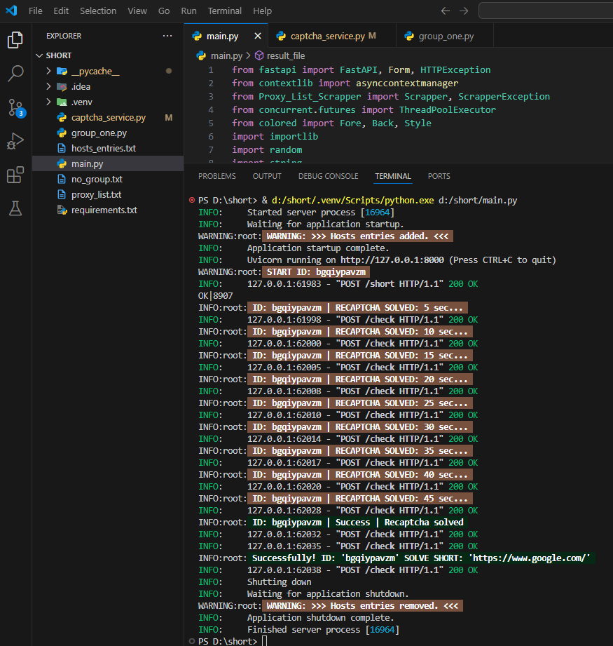

## solver paid short links
This project is a server application written in Python using FastAPI to solve short links to cryptocurrency faucets.



```
IMPORTANT (app test):
I recommend using a virtual environment (.venv) 
Python version Python 3.11.4
Windows 11/x64
```
## install

> git clone https://github.com/Roboxkin/shortlink-solver.git

> cd shortlink-solver

>pip install requirements.txt

>python main.py

#### The server will start and be ready for work, about which the corresponding message will be displayed in the console
```PS D:\short> & d:/short/.venv/Scripts/python.exe d:/short/main.py
INFO:     Started server process [16964]
INFO:     Waiting for application startup.
WARNING:root: WARNING: Hosts entries added.
INFO:     Application startup complete.
INFO:     Uvicorn running on http://127.0.0.1:8000 (Press CTRL+C to quit)
```
## Info
```
First of all, you need to send a post request with two parameters, where the first parameter is a short link, and the second parameter is the faucet domain.
In response, you will receive the ID of your request, but the work will continue in the background, and the result will be written to the file ID.txt
You need to periodically check the ID to find out the result of the end of the work.
IMPORTANT: After reading the result, the file is deleted from the server
```
## How to send a short link to a solution (python)
```python
# example code
# IMPORTANT: There are times when you need to check if a domain will work with a particular group.
# in this case:
# site_host = "test.test"

import requests
import time

short_url = "https://ccurl.net/Y6FekxlS"
site_host = "www.google.com"
first_host = "http://127.0.0.1:8000/short"
check_host = "http://127.0.0.1:8000/check"

response = requests.post(first_host, data={"shorturl": short_url, "faucet": site_host})

if "YOUR ID" in response.text:
    id_start = response.text.find("YOUR ID = ") + len("YOUR ID = ")
    id_end = response.text.find('"', id_start)
    id_value = response.text[id_start:id_end]
    print(f"(en) ID found: {id_value}")
else:
    print("ID not found")
    exit()

time_to_sleep = 5

while True:
    time.sleep(time_to_sleep)

    response = requests.post(check_host, data={"my_id": id_value})

    if "Successfully" in response.text:
        solve_start = response.text.find("solve short = ") + len("solve short = ")
        solve_end = response.text.find('"', solve_start)
        solve_short = response.text[solve_start:solve_end]

        if "Sorry" in solve_short:
            print(f"ShortLink: {short_url} | Status: {solve_short}")
            exit()
        else:
            print(f"SuccessLink: ({solve_short})")
            time.sleep(1)
            exit()
    else:
        print(f"(en) Short link is not ready {time_to_sleep} sec...")
        time_to_sleep += 5
```
## Template for the  bot minipPoster v.6.6.0.3.6
```
[SET_MODEL_SETTINGS][ERROR_EXIT]
[SET_MODEL_SETTINGS][MAX_BUFFER_SIZE][20000]

[VAR][$shortUrl][https://ccurl.net/Y6FekxlS]
[VAR][$siteHost][www.google.com]

[POST][http://127.0.0.1:8000/short][shorturl=$shortUrl&faucet=$siteHost]
[FIND_TEXT][YOUR ID]
[IF][$bool]
    [PARSE][YOUR ID = ]["]
    [VAR][$ID][$1]
    [CLEAR_BUFFER]
[ELSE]
    [DISPLAY][ID not found]
    [EXIT_TASK]
[ENDIF]

[VAR][$time][5]
[SLEEP][$time]
[BREAK_POINT][check1]
[POST][http://127.0.0.1:8000/check][my_id=$ID]
[FIND_TEXT][Successfully]
[IF][$bool]
    [PARSE][solve short = ]["]
    [VAR][$solve_short][$1]
    [CLEAR_BUFFER]
    [FIND_TEXT][Sorry][$solve_short]
    [IF][$bool]
        [DISPLAY][ShortLink: $shortUrl | Statuse: $solve_short]
        [LOG_DISPLAY][ShortLink: $shortUrl | Statuse: $solve_short]
        [EXIT_TASK]
    [ELSE]
        [DISPLAY][shortLink status: === Successfully === | SuccesLink: ($solve_short)]
        [SLEEP][1]
        [EXIT_TASK]
    [ENDIF]
[ELSE]
    [DISPLAY][Short Link is not ready $time sec...]
    [SLEEP][5]
    [MATH][$time+5]
    [VAR][$time][$result]
    [GO_TO_BREAK_POINT][check1]
[ENDIF]
```
## Project features:
```
Calability:
You can extend the capabilities by adding a new template (.py), there are no restrictions.
```
```
Multithreading:
This application is multithreaded, which means that you can solve several short links at the same time.
IMPORTANT: Default 3 ( I recommend using 1-2, it all depends on the power of your PC )
```
```
Asynchronicity:
All functions are executed asynchronously, which means there will be no downtime or delays in code execution.
```
```
Bypassing Cloudflare:
When the application is launched, records from hosts_entries.txt are added to the system host file.
If you have an IP address from the domain that is used in the short link,
add it to the hosts_entries.txt file so that requests to this domain are made directly.  
**IMPORTANT:** When the application is stopped, records from the system host file are deleted.
```
```
Captcha solving:
At the moment, the application uses the code for the XEvil program,
you can add your own service to solve the captcha.
```
```
Logging:
For convenience, the application uses a logging system, error and exception handling.
```
```
Documentation:
All functions are well commented in Russian and English.
```
```
Domain Grouping:
In fact, all sources of shorteners work on the same principle, but with minor differences.
Therefore, bflo decided to write an application for domain groups.
```
```
Change a domain from one to another:
Sometimes tricky shorteners redirect from the first domain to the second,
where you need to perform some actions, then redirect back to the first.

The system provides for this, if you know from which domain to which changes,
you can add a domain to the list for substitution.
```
## FAQ
> How to increase or decrease the number of threads?

```python
# Change the line to the desired quantity (main.py)
fsemaphore = asyncio.Semaphore(3)
```
> How to add a replacement domain?

```python
# IMPORTANT: The replacement domain and the new domain must be in the same index.
first_list_domain = ["iir.la", "clk.wiki"] # List of domains to replace
second_list_domain = ["oii.la", "clk.kim"] # List of new domains
```
> What is a domain group?

```python
# As already written above, shorteners are very similar to each other and in order not
# to write a template for each domain, they can be combined into one group.
# Example:
group_one = ["ccurl.net"] # domain list group_one.py
group_two = []            # domain list group_two.py
group_three = []          # domain list group_three.py
group_four = []           # domain list group_four.py
group_five = []           # domain list group_five.py
group_six = []            # domain list group_six.py
group_seven = []          # domain list group_seven.py
group_eight = []          # domain list group_eight.py

# If you don't have an IP from the domain and cloudflare doesn't let you through
cloudflare = ["cety.app", "cuty.io"]

# It happens that the shortener "died"
blacklist = []

# Forced error
error = ["error.error"]
```
> Support the author and the project


Bitcoin — 1FkgsC87HTJiYjwjyZDTt1GQ1xACj8dz2D  
Ethereum — 0x0aD44a4566f62D4f6A2772815D90B1C84a426F56  
Tether USD (TRC20) — TPnb9xUtDzpAPXtY1DnSNRxdLYPkFwf5Aj  
TRX — TPnb9xUtDzpAPXtY1DnSNRxdLYPkFwf5Aj  
Bitcoin Cash — bitcoincash:qr2qmsfq9f2fxf86fyppd0jvulrkufzsqu793q2r2j
